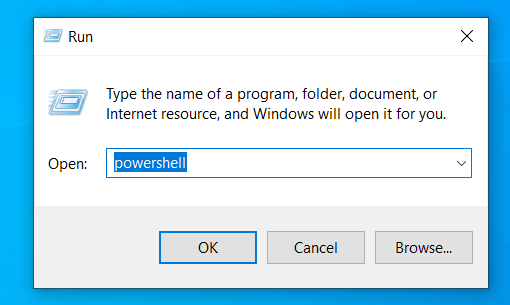
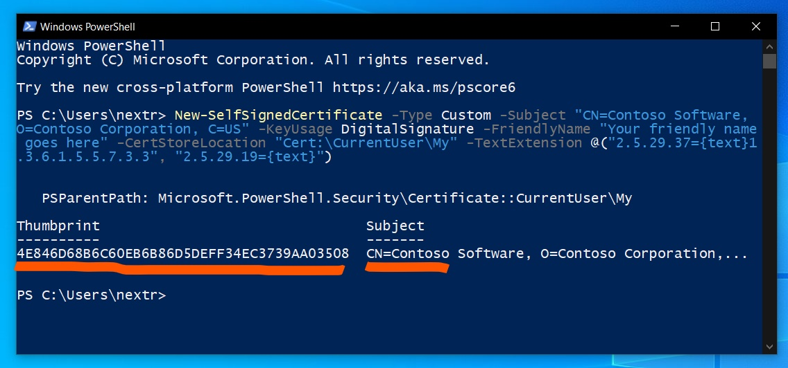
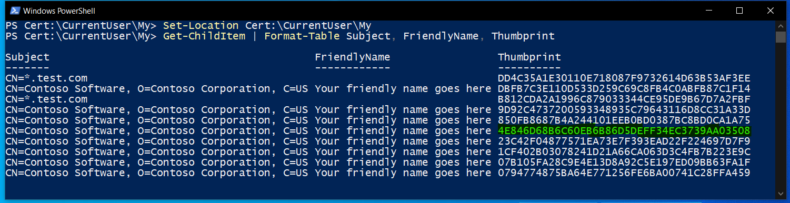
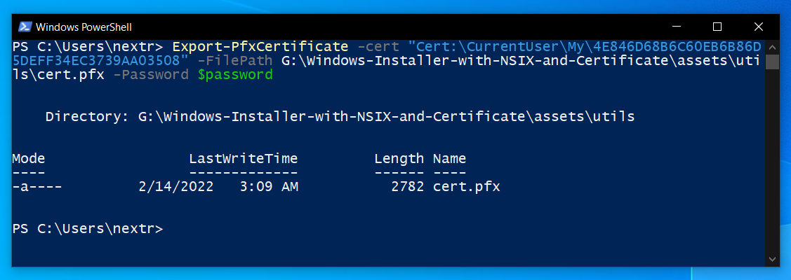
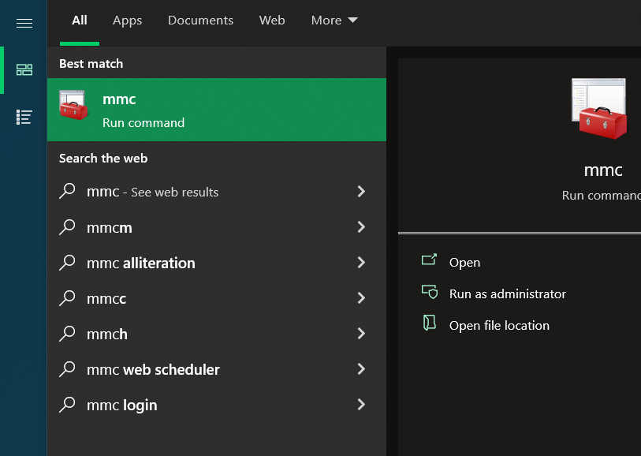
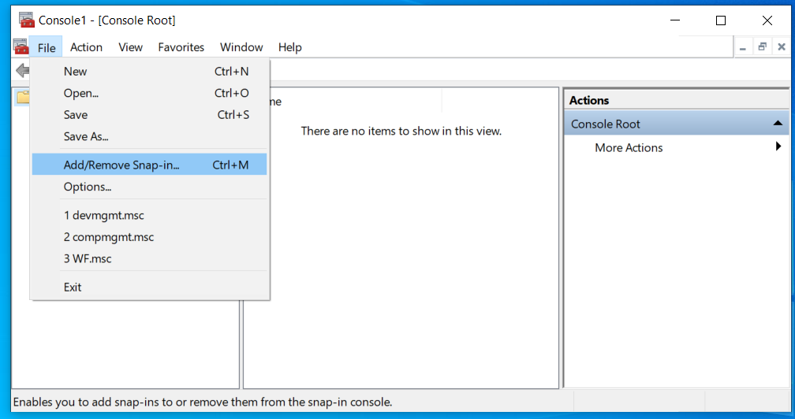
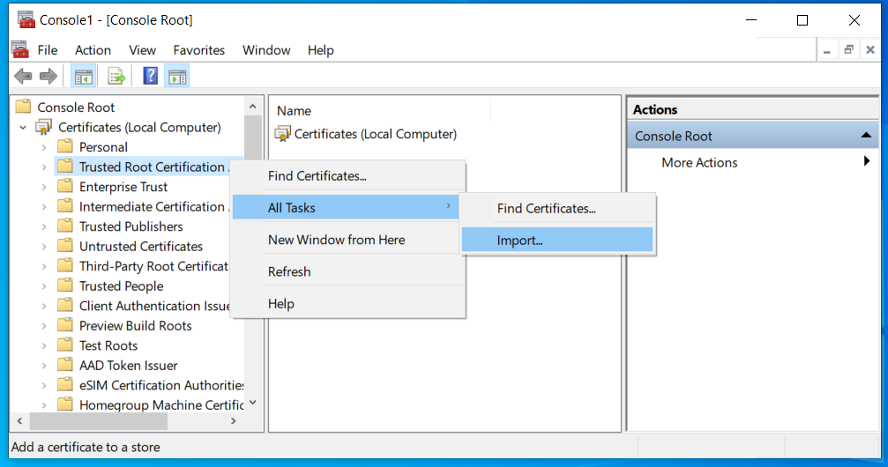
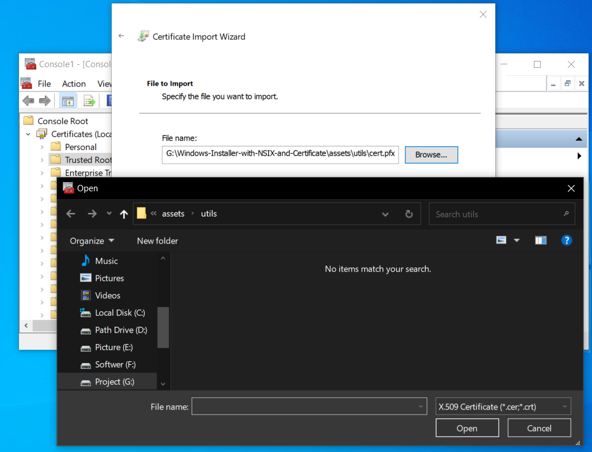
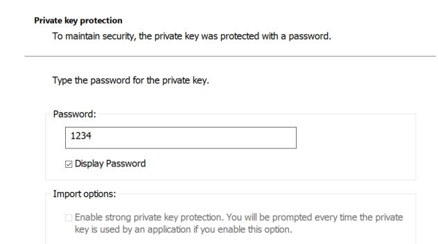
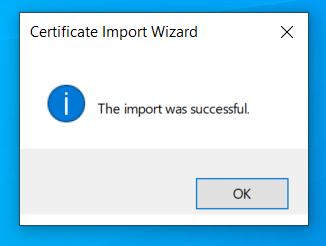

# Please read the all documentation if this doc is not working. documentation linked below step by step

https://pub.dev/packages/msix

## package config

### pubspec.yaml
#### msix_config:
####   publisher: CN=Blackshadow
####   display_name: Blackshadow
####   publisher_display_name: Blackshadow
####   identity_name: MyCompany.MySuite.MyApp
####   msix_version: 1.0.0.0
####   logo_path: G:\Windows-Installer-with-NSIX-and-Certificate\assets\utils\logo.png
####   certificate_path: G:\Windows-Installer-with-NSIX-and-Certificate\assets\utils\cert.pfx
####   certificate_password: 1234

## First step
 
 
    
 
 
 
### https://docs.microsoft.com/en-us/windows/msix/package/create-certificate-package-signing

### PowerShell

New-SelfSignedCertificate -Type Custom -Subject "CN=Contoso Software, O=Contoso Corporation, C=US" -KeyUsage DigitalSignature -FriendlyName "Your friendly name goes here" -CertStoreLocation "Cert:\CurrentUser\My" -TextExtension @("2.5.29.37={text}1.3.6.1.5.5.7.3.3", "2.5.29.19={text}")
 
 
    
 

 
### PowerShell

Set-Location Cert:\CurrentUser\My
Get-ChildItem | Format-Table Subject, FriendlyName, Thumbprint

 
 
    
 

 
### predefined certificate path
G:\Windows-Installer-with-NSIX-and-Certificate\assets\utils\cert.pfx
### Thumbprint
4E846D68B6C60EB6B86D5DEFF34EC3739AA03508

### Export a certificate. Password usage
### doc
$password = ConvertTo-SecureString -String <Your Password> -Force -AsPlainText 
Export-PfxCertificate -cert "Cert:\CurrentUser\My\<Certificate Thumbprint>" -FilePath <FilePath>.pfx -Password $password

### ready to run
$password = ConvertTo-SecureString -String 1234 -Force -AsPlainText 
Export-PfxCertificate -cert "Cert:\CurrentUser\My\4E846D68B6C60EB6B86D5DEFF34EC3739AA03508" -FilePath G:\Windows-Installer-with-NSIX-and-Certificate\assets\utils\cert.pfx -Password $password

 
    

## Second step
https://community.flexera.com/t5/InstallShield-Knowledge-Base/How-to-add-certificates-to-the-Trusted-Root-Certification/ta-p/4118

#### 1. Click Start, click Start Search, type mmc, and then press ENTER.
 
 
 
    
 

 
#### 2. On the File menu, click Add/Remove Snap-in.
  

 
    

   
#### 3. Under Available snap-ins, click Certificates,and then click Add. 
#### 4. Under This snap-in will always manage certificates for, click Computer account, and then click Next.
#### 5. Click Local computer, and click Finish.
#### 6. If you have no more snap-ins to add to the console, click OK.
#### 7. In the console tree, double-click Certificates (Local Computer). double-click Certificates.
#### 8. Right-click the Trusted Root Certification Authorities store - select All Tasks.
#### 9. Click Import to import the certificates and follow the steps in the Certificate Import Wizard.
  

 
    

  
#### 10 Browse and navigate to the .pfx file. and next
  

 
    

    
#### 11 Password 1234 and next => next => Finish => OK
  

 
    
    

  
   

## Third step
#### flutter clean
#### flutter build windows --release
#### flutter pub run msix:create
### msix created: build\windows\runner\Release\windows_installer_msix_dertificate.msix

